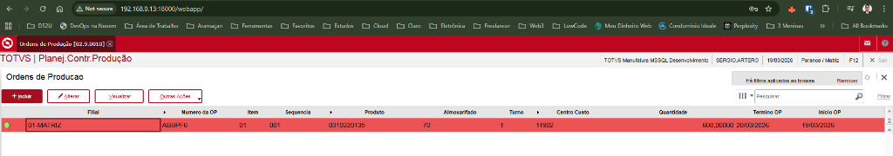
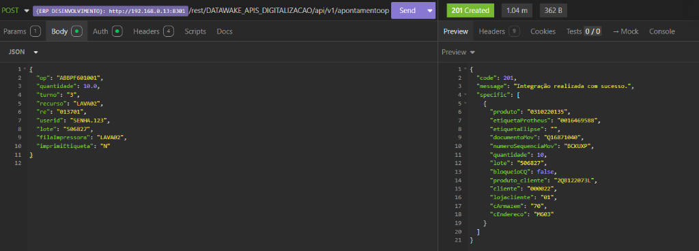
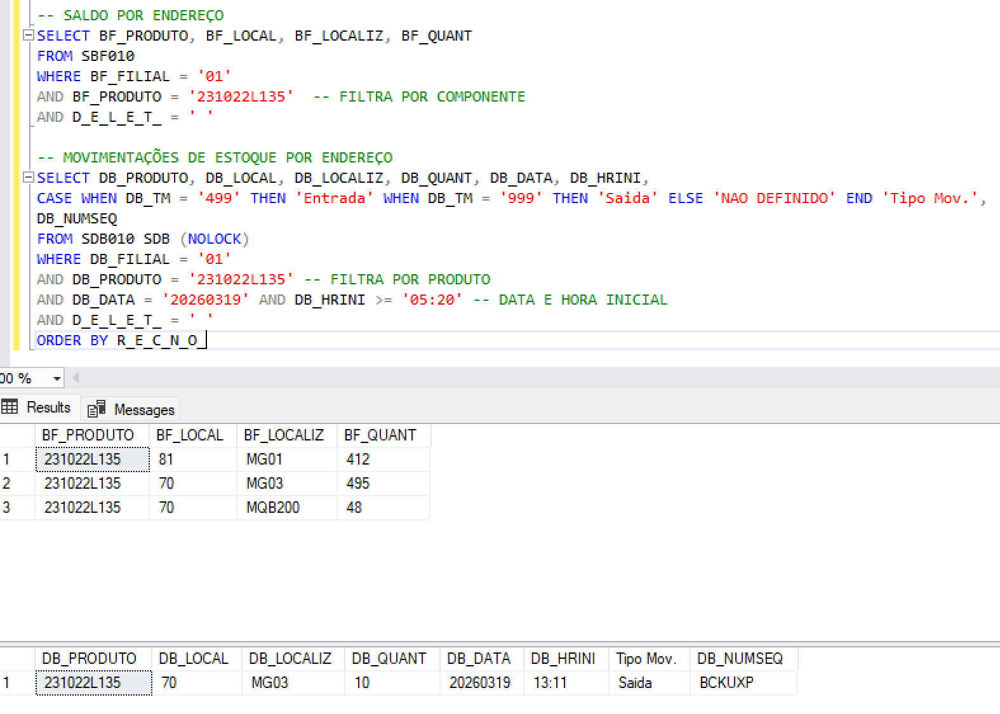
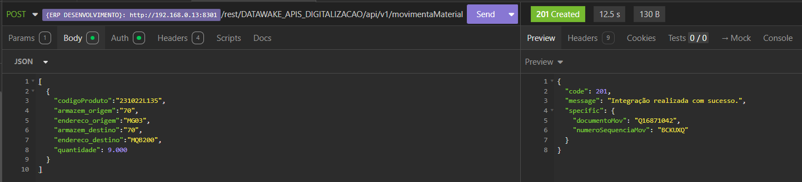
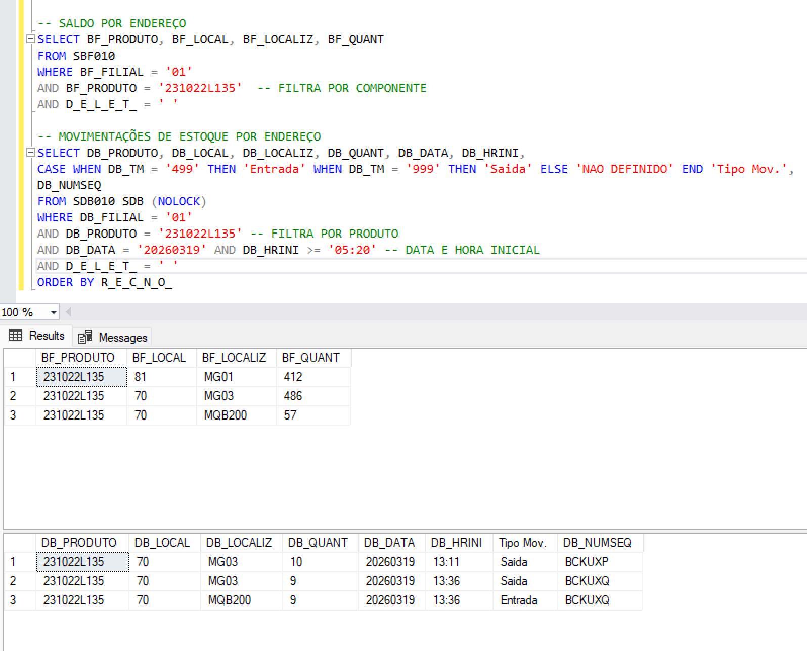
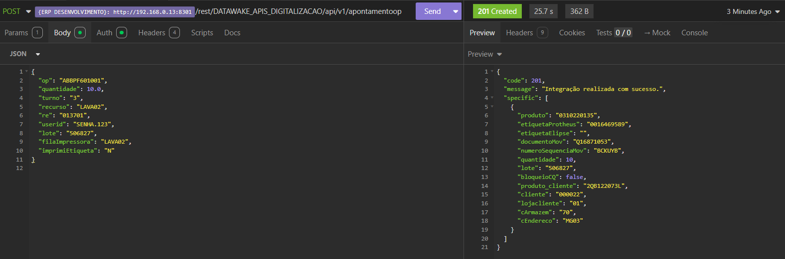
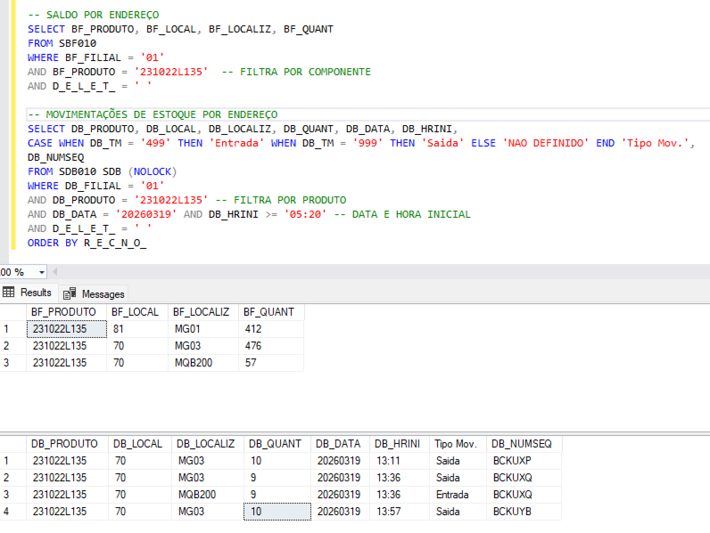
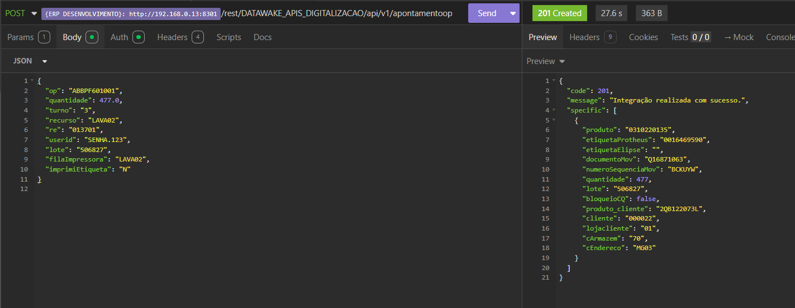
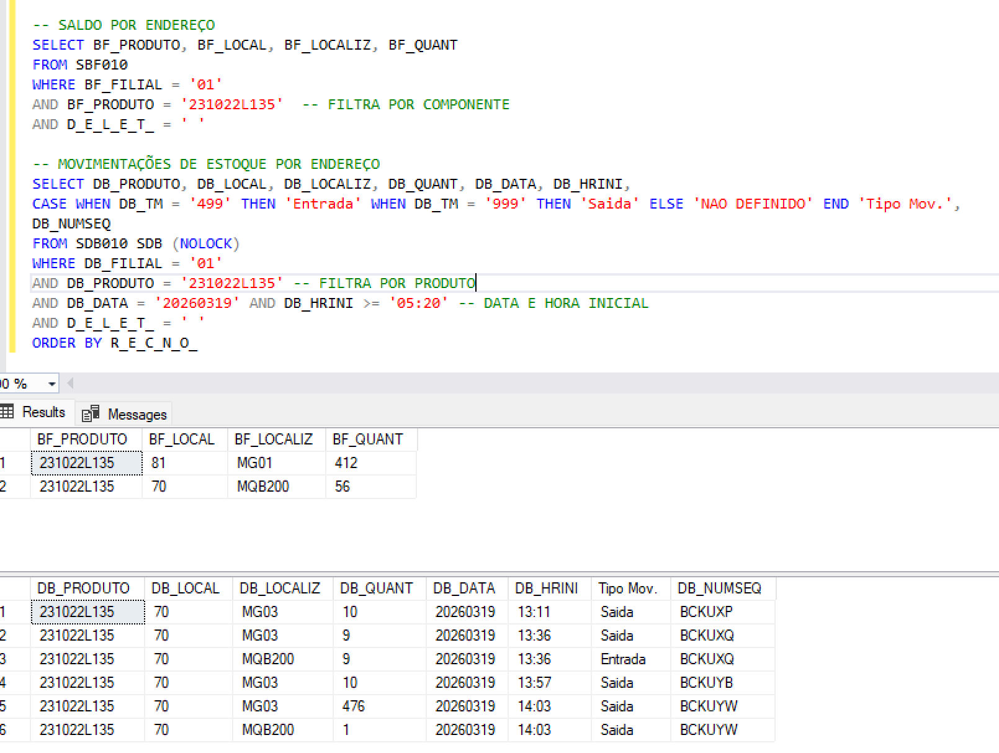
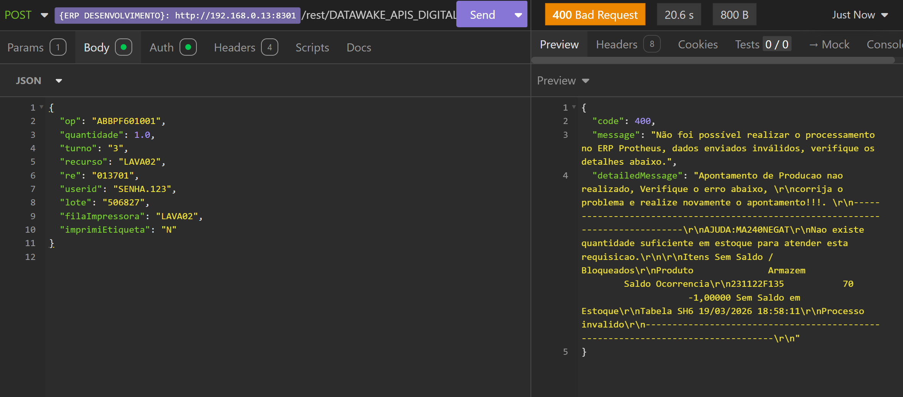

# BUG FIX — 18/03/2026

## Descritivo do Problema

Os apontamentos de produção acontecem no **armazém 70**, endereço **MG03**. Quando acontece uma reprova, o Elipse consome a API de reprova que internamente realiza movimentação dos componentes para o endereço **MQB200**, dentro do mesmo armazém 70.

Quando este componente precisa ser devolvido para o endereço **MG03**, o sistema valida dizendo que **não tem Saldo**.

## Análise do Problema

Identificado que **somente neste processo** existe o controle de endereço, e o processo de apontamento de produção que é feito **não considera o endereço como parâmetro** para saber de onde deve consumir, somente o armazém.

Isso faz com que seja consumido saldo do endereço **MQB200** no processo de apontamento de produção, quando na verdade deveria ser consumido somente do endereço **MG03**.

## Reprodução do Problema

Primeira parte é isolar um caso para replicarmos em ambiente de desenvolvimento. Foi selecionado o caso da etiqueta **E000022SWC**, conforme print das queries executadas para rastrear a OP no ERP Totvs Protheus.

### Queries Executadas

```sql
SELECT * FROM [dw_paranoa]..dw_reprova_apontamento WHERE etiqueta = 'E000022SWC'
SELECT * FROM [dw_paranoa]..dw_etiqueta WHERE codigo = 'E000022SWC'
SELECT * FROM [dw_paranoa]..dw_ordem_producao WHERE id = 257180
SELECT * FROM [PROTHEUS_PRD]..SC2010 WHERE C2_NUM = 'ABPNEY'
```

### Resultados das Queries

#### `dw_reprova_apontamento`

| Campo                | Valor                |
|----------------------|----------------------|
| id                   | 30383                |
| codigo_pendente      | NULL                 |
| unidade_producao_id  | 463                  |
| retro_gu             | 1347                 |
| ordem_producao_id    | 257180               |
| colaborador_id       | 2015                 |
| motivo               | REPROVA              |
| etiqueta             | E000022SWC           |
| bobetada             | montagem             |
| usuario_criacao      | NULL                 |
| usuario_atualizacao  | NULL                 |
| data_criacao         | 2026-03-12 05:21:12.867 |
| data_atualizacao     | 2026-03-12 05:21:12.867 |
| turno_id             | 3                    |
| login_M              | NULL                 |

#### `dw_etiqueta`

| Campo                  | Valor                |
|------------------------|----------------------|
| id                     | 3488596              |
| ordem_producao_id      | 257180               |
| unidade_producao_id    | 463                  |
| operacao_id            | 602                  |
| etiqueta_id            | NULL                 |
| codigo                 | E000022SWC           |
| codigo_eps             | NULL                 |
| quantidade             | 31.0000              |
| ep_queue_id            | NULL                 |
| microtempo_apoint_id   | NULL                 |
| data_criacao           | 2026-03-12 05:21:12.850 |
| lote                   | NULL                 |
| data_criacao_empresa    | NULL                 |
| material_tp            | NULL                 |
| status_id              | 5                    |
| cliente                | NULL                 |
| kpadecimot             | NULL                 |
| bloqueado              | NULL                 |
| armazem                | NULL                 |
| procuro_cliente        | NULL                 |
| movimento_id           | NULL                 |
| tipo_id                | 3                    |
| data_destado           | NULL                 |

#### `dw_ordem_producao`

| Campo                  | Valor                |
|------------------------|----------------------|
| id                     | 257180               |
| n_ordem_producao       | ABPNEY0101           |
| tipo_id                | 1                    |
| situacao_id            | —                    |
| data_criacao_origem     | 2026-01-11           |
| data_criacao           | 2026-01-11           |
| data_mod_previsto      | 2025-03-11           |
| data_criacao           | 2026-01-11 14:59:24.707 |
| situacao               | integrado            |
| smarro_atualizacao     | —                    |
| data_atualizacao       | 2026-03-19 11:29:44 (60) |
| produto_id             | 2175                 |
| lote                   | 1026                 |
| lota_secoes_lote       | 216                  |
| unidade_producao_vencido | 11902              |
| centro_trabalho_id     | —                    |
| quantidade             | 420                  |
| quantidade_produzida   | 69.0000              |
| quantidade_saldo_vi    | —                    |
| turno_cod              | —                    |

#### `SC2010` (Protheus)

| Campo | Valor |
| :--- | :--- |
| C2_FILIAL | 01 |
| C2_NUM | ABPNEY |
| C2_ITEM | 01 |
| C2_SEQUEN | 001 |
| C2_PRODUTO | 0310220135 |
| C2_LOCAL | 70 |
| C2_CC | 11902 |
| C2_QUANT | 600 |
| C2_UM | PC |
| C2_DATPRI | 20260311 |
| C2_DATPRF | 20260311 |
| C2_CMSSAO | 20260311 |

## OP ABBPF601001 criada em ambiente de DESENVOLVIMENTO



## Apontamento de Produção via API /rest/DATAWAKE_APIS_DIGITALIZACAO/api/v1/apontamentoop



### Saldo por Endereço ficou assim:



## Movimentação de Material
Foi movimentado o saldo de 9 do endereço **MG03** para o endereço **MQB200**




### Saldo por Endereço ficou assim:


## Novo apontamento de Produção

Novo apontamento de quantidade 10



### Saldo por Endereço ficou assim:

Consumiu do endereço correto


## Novo apontamento de Produção além do saldo atual de 476

Novo apontamento de quantidade 477


### Saldo por Endereço ficou assim:

Consumiu do endereço correto a quantidade total de 476 e o que faltou do endereço errado.

Portanto, isso prova que o processo de apontamento de produção não considera o endereço como parâmetro para saber de onde deve consumir, somente o armazém. Neste caso, o sistema deveria retorna saldo insuficiente por não ter saldo no endereço MG03.



## Solução

Foi criado um ponto de entrada na função MT250SAL para que seja possível manipular os valores de saldos dos produtos a serem requisitados pelo apontamento. Com isso, somente para o Armazém 70, configurado através do parâmetro ES_MQBLO40, e o endereço MQB200, configurado através do parâmetro ES_MQBEN40, o sistema não irá considerar o saldo do endereço MQB200 para o apontamento de produção, e sim somente o saldo do endereço MG03 (atual) ou outros que possam surgir.

### Resultado via API

